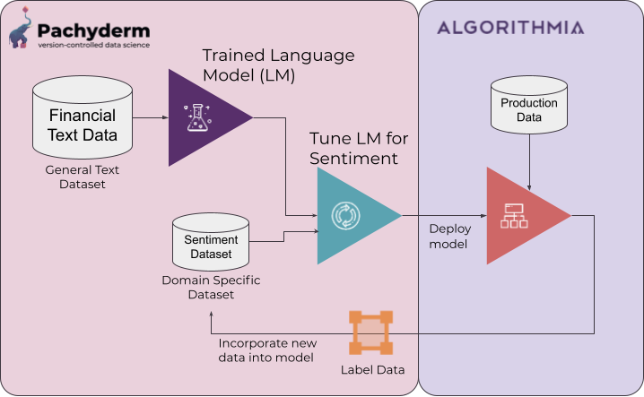
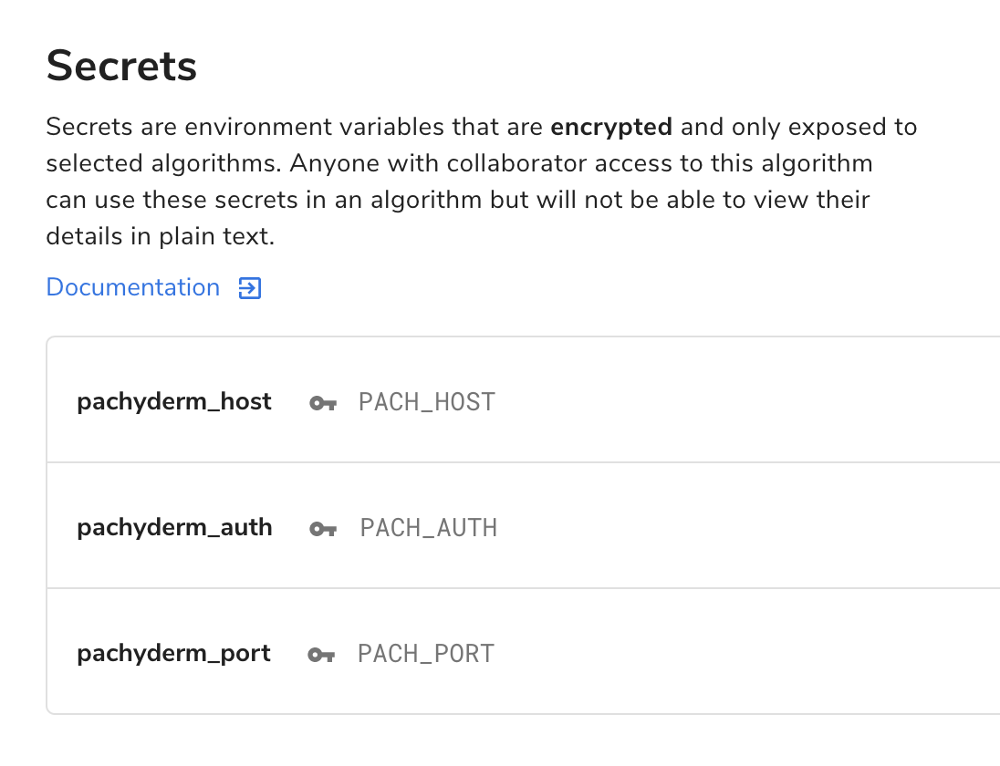

# Algorithmia Model Deployment - Market Sentiment

<p align="center">
	
</p>

In this example, we show you how to deploy the model created in the [Market Sentiment Example](../market-sentiment) with Algorithmia. 

Once deployed, Algorithmia will pull the market sentiment model from your Pachyderm cluster, serve the model for inference, and send predictions back to Pachyderm for labeling and model iteration.

You can find this code on the Algorithmia marketplace as [jimmyw/market_sentiment](https://algorithmia.com/algorithms/jimmyw/market_sentiment).

## Requirements

1. A Pachyderm cluster with the running [Market Sentiment Example](../market-sentiment).
2. An [Algorithmia](https://algorithmia.com/trial) account.

## Configure the deployment

1. Create an authentication token in Pachyderm.

In Pachyderm 1.x, you can use the token that is in your config file (`~/.pachyderm/config.json`).

2. Create Algorithmia Secrets for the Pachyderm Host, Pachyderm Authentication Token, and the Pachyderm Port. See [Algorithmia Secret Store](https://algorithmia.com/developers/platform/secret-store) for details. 

The format for each of these should be:

`PACH_HOST = hub-x0-xyz.clusters.pachyderm.io`
`PACH_AUTH = <Pachyderm Authentication Token>`
`PORT = 31400`

<p align="center">
  
</p>

The Algorithmia deployment will use [python-pachyderm](https://github.com/pachyderm/python-pachyderm) to pull the `master` version of the model and write predictions to the `raw_data` data repository (for use with the [label studio integration](../market-sentiment/README#labeling)). 

Note: If you would like to change the version of the model deployed, you can set the global `MODEL_VERSION` in [`algorithmia/src/Algorithm.py`](src/Algorithm.py) to the branch you want to deploy. 

## Deployment

1. Create a Pachyderm repository `raw_data` to hold our predictions

```bash
pachctl create repo raw_data
```

2. [Publish the model](https://algorithmia.com/developers/algorithm-development/algorithm-management) on Algorithmia. 