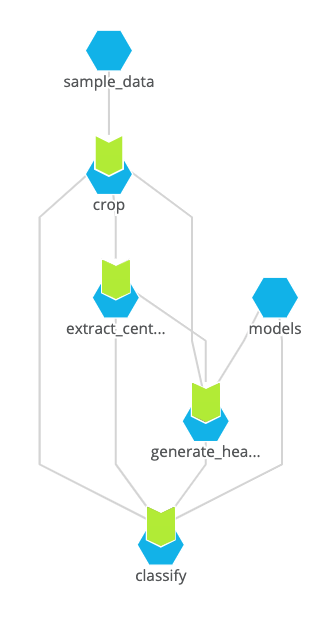

# Breast Cancer Detection

In this example, we create a scalable inference pipeline for breast cancer detection.

There are different ways to scale inference pipelines and deep learning models. Here we decided to separate out the CPU-based preprocessing and GPU-related tasks. By separating the inference tasks, pipelines can be updated independently, allowing ease of model deployment and collaboration.

The underlying code and model comes from [this repo](https://github.com/nyukat/breast_cancer_classifier), developed by a team at NYU. The original paper can be found [here](https://ieeexplore.ieee.org/document/8861376).


## Running the Example

This example takes an existing repo that performs breast cancer detection and classification and runs it on Pachyderm to illustrate Pachyderm parallelism and ease of integration.

### Pachyderm Parallelism

In this example, we perform two types of parallelism:

1. Task parallelism - split the `run.sh` script into different steps.
2. Data parallelism - distribute the data so that each exam can be processed in parallel.

#### Data Parallelism

Pachyderm is built with the intention of performing data parallelism. By defining glob patterns in our pipeline, we can specify how Pachyderm should split the data so that the code can execute as parallel jobs without having to modify the underlying implementation.

We will treat each exam (4 images and a list file) as a single datum. Each datum will be processed individually, allowing parallelize computation for each exam that is added. The file structure for our `sample_data` will be organized as follows:

```
sample_data/
├── <unique_exam_id>
│   ├── L_CC.png
│   ├── L_MLO.png
│   ├── R_CC.png
│   ├── R_MLO.png
│   └── gen_exam_list_before_cropping.pkl
├── <unique_exam_id>
│   ├── L_CC.png
│   ├── L_MLO.png
│   ├── R_CC.png
│   ├── R_MLO.png
│   └── gen_exam_list_before_cropping.pkl
...
```

Note: The `gen_exam_list_before_cropping.pkl` is a pickled version of the image list, a requirement of the underlying library being used.

We can deploy the example to our Pachyderm cluster by running the following:

```bash
pachctl create repo models
pachctl create repo sample_data
pachctl put file -r models@master:/ -f models/
pachctl put file -r sample_data@master:/ -f sample_data/
pachctl create pipeline -f single-stage/bc_classification.json
```

Note: There are also CPU versions of the pipeline if GPUs are not available.

This will create the needed repos, copy the data into them, and deploy our pipeline. Once the pipeline is deployed it will automatically start running on the data that has been pushed to the `sample_data` repo - one job for each breast exam.

#### Task Parallelism

Many machine learning project rely on data preprocessing before the model is run. It often does not require GPU acceleration, and can be scaled separately from the GPU inference code.

We split the `run.sh` script into 4 separate processing steps (already defined in the script) which will become Pachyderm pipelines, so each can be scaled separately.

1. Crop
2. Extract Centers
3. Generate Heatmaps
4. Classify

Image cropping and extracting centers are process intensive, however they do not require GPUs. By separating steps 1-2 from 3-4, we can avoid allocating GPU resources until after the data is prepared.

The final pipeline graph (directed acyclic graph, or DAG) is shown in the image below (we  manually draw in the connections for the input `join` since the dash does not display them).

<p align="center">
  
</p>

The entire DAG can be created with the following commands:

```bash
pachctl create repo models
pachctl create repo sample_data
pachctl put file -r models@master:/ -f models/
pachctl put file -r sample_data@master:/ -f sample_data/
pachctl create pipeline -f multi-stage/crop.json
pachctl create pipeline -f multi-stage/extract_centers.json
pachctl create pipeline -f multi-stage/generate_heatmaps.json
pachctl create pipeline -f multi-stage/classify.json
```

Once this DAG of pipelines is set up, you only need to upload new images to run the classification on the new data. Pachyderm automatically detects that a new, unprocessed datum is present and starts each job once when it is ready to process.

## Updating Models

Pachyderm's pipeline system can also combine inputs in useful ways. Because we have separated out the models from our data, we can update the models independently and Pachyderm will know which predictions came from which models. Furthermore, we can have it reprocess data with the updated model by defining our input glob patterns appropriately. The `generate_heatmaps` and `classify` pipelines already have this pattern in their input definitions (the `cross` object). For more information on cross glob patterns see our documentation [here](https://docs.pachyderm.com/latest/concepts/pipeline-concepts/datum/cross-union/#cross-input).


## Citations

**Deep Neural Networks Improve Radiologists' Performance in Breast Cancer Screening**\
Nan Wu, Jason Phang, Jungkyu Park, Yiqiu Shen, Zhe Huang, Masha Zorin, Stanisław Jastrzębski, Thibault Févry, Joe Katsnelson, Eric Kim, Stacey Wolfson, Ujas Parikh, Sushma Gaddam, Leng Leng Young Lin, Kara Ho, Joshua D. Weinstein, Beatriu Reig, Yiming Gao, Hildegard Toth, Kristine Pysarenko, Alana Lewin, Jiyon Lee, Krystal Airola, Eralda Mema, Stephanie Chung, Esther Hwang, Naziya Samreen, S. Gene Kim, Laura Heacock, Linda Moy, Kyunghyun Cho, Krzysztof J. Geras\
IEEE Transactions on Medical Imaging\
2019
