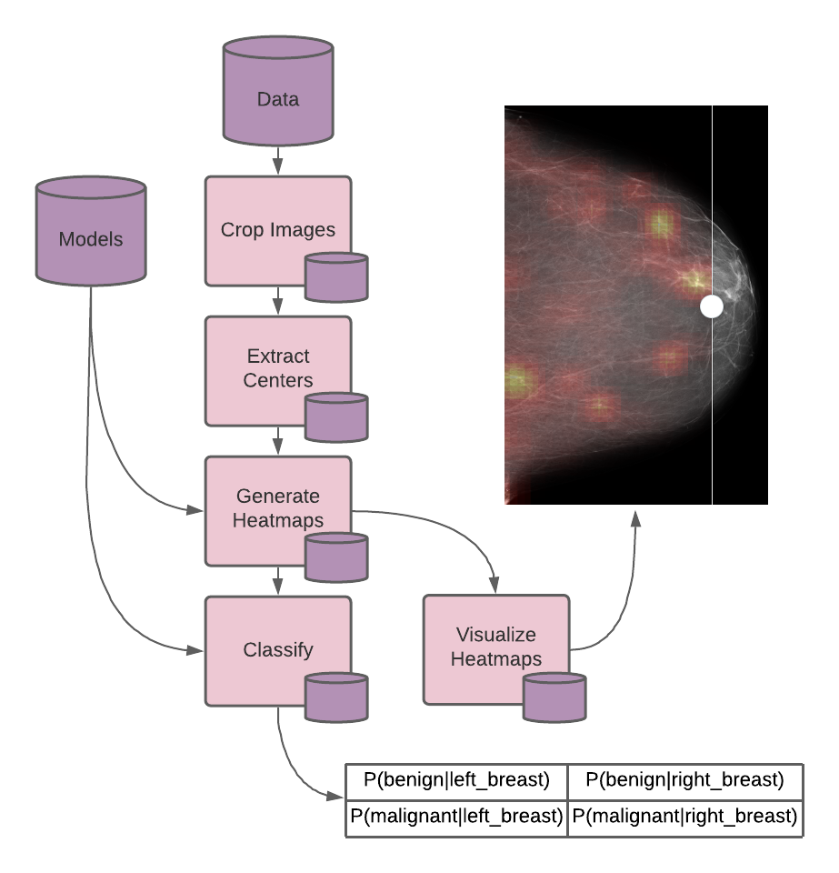
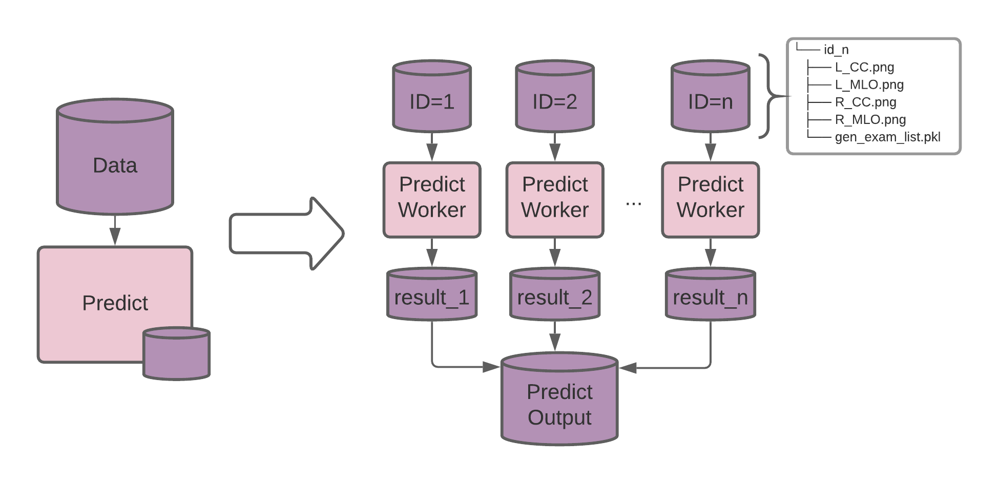
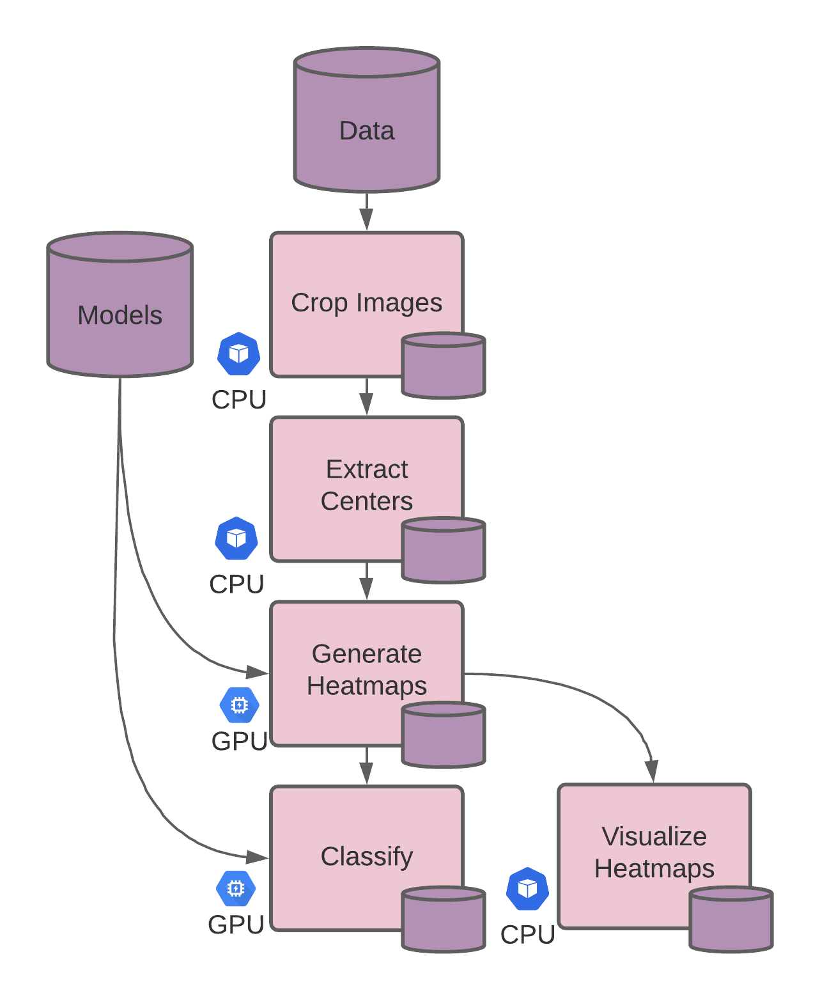

# Breast Cancer Detection

In this example, we create a scalable inference pipeline for breast cancer detection.

<p align="center">
  
</p>

There are different ways to scale inference pipelines with deep learning models. We implement two methods here with Pachyderm: data parallelism and task parallelism.

- In data parallelism, we split the data, in our case breast exams, to be processed independently in separate processing jobs.

- In task parallelism, we separate out the CPU-based preprocessing and GPU-related tasks, saving us cloud costs when scaling.

By separating inference into multiple tasks, each task pipeline can be updated independently, allowing ease of model deployment and collaboration.

The underlying code and pre-trained breast cancer detection model comes from [this repo](https://github.com/nyukat/breast_cancer_classifier), developed by the Center of Data Science and Department of Radiology at NYU. Their original paper can be found [here](https://ieeexplore.ieee.org/document/8861376).

## Implementing a Pipeline in Pachyderm
A Pachyderm Pipeline can be defined in three steps:

1. Define a Dockerfile
The next step is to build a Docker image for our code. This is relatively simple - we clone the repository into the image and install the requirements. There are occasions where a system library is needed, which can be easily solved by adding it to the Dockerfile. Once the Docker image is built, the entire system needed to run the classifier is encapsulated in a snapshot.

2. Create an Entrypoint 
In the original code, there is a `run.sh` script that reads sample data and outputs predictions (along with intermediate files necessary to produce the prediction). This script can be used as the entrypoint to the container. This equivalent to the entrypoint for a Docker image.


3. Create a Pipeline Spec
The Pipeline Spec is a JSON file that is used to tell Pachyderm how to deploy the pipeline. We define the inputs, the Docker image to be used, the entrypoint, and any other configuration needed. A full list of the pipeline specification parameters can be found [here](https://docs.pachyderm.com/latest/reference/pipeline_spec/). 

## Data Parallelism
<p align="center">
  
</p>

Pachyderm is built with the intention of performing data parallelism. By defining [glob patterns](https://docs.pachyderm.com/latest/concepts/pipeline-concepts/datum/glob-pattern/) in our pipeline, we can specify how Pachyderm should split the data so that the code can execute as parallel jobs without having to modify the underlying implementation.

We will treat each exam (4 images and a list file) as a single datum. Each datum will be processed individually, allowing parallelize computation for each exam that is added. The file structure for our `sample_data` will be organized as follows:

```
sample_data/
├── <unique_exam_id>
│   ├── L_CC.png
│   ├── L_MLO.png
│   ├── R_CC.png
│   ├── R_MLO.png
│   └── gen_exam_list_before_cropping.pkl
├── <unique_exam_id>
│   ├── L_CC.png
│   ├── L_MLO.png
│   ├── R_CC.png
│   ├── R_MLO.png
│   └── gen_exam_list_before_cropping.pkl
...
```

Note: The `gen_exam_list_before_cropping.pkl` is a pickled version of the image list, a requirement of the underlying library being used.

#### Input Patterns
We can connect data repositories to pipelines in various ways. The configuration below combines the `sample_data` and `models` repo.

```json
"input": {
   "cross": [
     {
       "pfs": {
         "repo": "sample_data",
         "glob": "/*"
       }
     },
     {
       "pfs": {
         "repo": "models",
         "glob": "/"
       }
     }
   ]
 }
```

The [cross](https://docs.pachyderm.com/latest/concepts/pipeline-concepts/datum/cross-union/) operator combines gives the worker access to every combination of the two repos datums.

A [datum](https://docs.pachyderm.com/latest/concepts/pipeline-concepts/datum/relationship-between-datums/) is an abstract way to think about how data should be mapped into a pipeline. The [glob pattern](https://docs.pachyderm.com/latest/concepts/pipeline-concepts/datum/glob-pattern/) specifies what a repo's dataums are. In the configuration above, the glob pattern treats all of the `models` repo's data as a single datum, meaning it will be available to every job. The sample data glob pattern defined, `/*`, specifies that every top-level file (in our case an exam directory) is a datum. Each of those datums can be processed in parallel by separate workers allowing your inference engine to scale seamlessly and proportionally to the number of exams.

We can deploy the example to our Pachyderm cluster by running the following code snippet. This will create the needed repos, copy the data into them, and deploy our pipeline. Once the pipeline is deployed it will automatically start running on the data that has been pushed to the `sample_data` repo - one datum for each breast exam.

```bash
pachctl create repo models
pachctl create repo sample_data
pachctl put file -r models@master:/ -f models/
pachctl put file -r sample_data@master:/ -f sample_data/
pachctl create pipeline -f single-stage/bc_classification.json
```

Note: There is a CPU version of the pipeline if GPUs are not available: `single-stage/bc_classification_cpu.json`.

## Task Parallelism

<p align="center">
  
</p>

Many machine learning projects require some amount of data pre-processing before the model can be run on the data. This pre-processing does not typically require GPU acceleration, and can be scaled separately from the GPU-based inference code.

We split the `run.sh` script into 5 separate processing steps (4 already defined in the script + a visualization step) which will become Pachyderm pipelines, so each can be scaled separately. The resource requirements are shown in the image above.

1. Crop
2. Extract Centers
3. Generate Heatmaps
4. Visualize Heatmaps
5. Classify

We can specify the needed resources in our configuration with the following:

```json
"resource_limits": {
   "gpu": {
     "type": "nvidia.com/gpu",
     "number": 1
   }
 }
```

Note: The `standby` feature in the pipeline spec allows the nodes to be de-allocated whenever there is no job to be run, which can be useful if a cluster has limited GPU resources.

The entire DAG can be created with the following commands:

```bash
pachctl create repo models
pachctl create repo sample_data
pachctl put file -r models@master:/ -f models/
pachctl put file -r sample_data@master:/ -f sample_data/
pachctl create pipeline -f multi-stage/crop.json
pachctl create pipeline -f multi-stage/extract_centers.json
pachctl create pipeline -f multi-stage/generate_heatmaps.json
pachctl create pipeline -f multi-stage/classify.json
```

Once these repos and pipelines are set up, you only need to upload a new scan to the `sample_data` repo to run the classification on the new data. Pachyderm automatically detects that a new, unprocessed datum is present and starts a pipeline job once when it is ready to process.

## Updating Models

Pachyderm relies on changes in data as the means of communication between pipelines and monitors when the pipelines are updated. These features allow the whole project to be a "living system," updating when new data comes in, and reprocessing when pipelines are updated. These features make Pachyderm a powerful platform for collaboration in data-driven development. 

For example, the system knows which predictions came from which models, by knowing what data inputs were combined in the pipeline to create that output. If we update the models, Pachyderm is able to detect that there are new combinations that have not been executed, and can update its predictions on scans with the newest model, committing the changes to its output repository. 

Additionally, when pipelines are updated, Pachyderm can **optionally** (alternatively, only use the new pipeline on new data) reprocesses all data affected with the updated code while leaving everything else untouched. It also kicks off any downstream pipeline whose input has changed, and skip any that have not.

For more information on how the pipeline system works, see [Pipeline Concepts](https://docs.pachyderm.com/latest/concepts/pipeline-concepts/).

Check out our similar projects in our [Bio-tech kit](https://www.pachyderm.com/use-cases/bio-tech/), or [connect with us on slack](https://www.pachyderm.com/slack/) to learn how to apply these techniques to your life science-related use case.
## Citations

**Deep Neural Networks Improve Radiologists' Performance in Breast Cancer Screening**\
Nan Wu, Jason Phang, Jungkyu Park, Yiqiu Shen, Zhe Huang, Masha Zorin, Stanisław Jastrzębski, Thibault Févry, Joe Katsnelson, Eric Kim, Stacey Wolfson, Ujas Parikh, Sushma Gaddam, Leng Leng Young Lin, Kara Ho, Joshua D. Weinstein, Beatriu Reig, Yiming Gao, Hildegard Toth, Kristine Pysarenko, Alana Lewin, Jiyon Lee, Krystal Airola, Eralda Mema, Stephanie Chung, Esther Hwang, Naziya Samreen, S. Gene Kim, Laura Heacock, Linda Moy, Kyunghyun Cho, Krzysztof J. Geras\
IEEE Transactions on Medical Imaging\
2019
