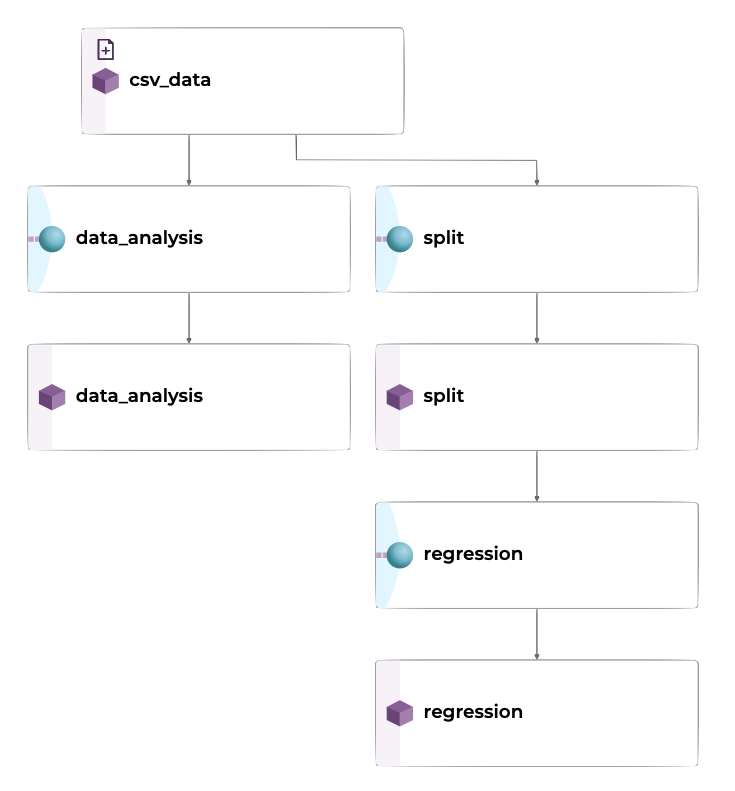
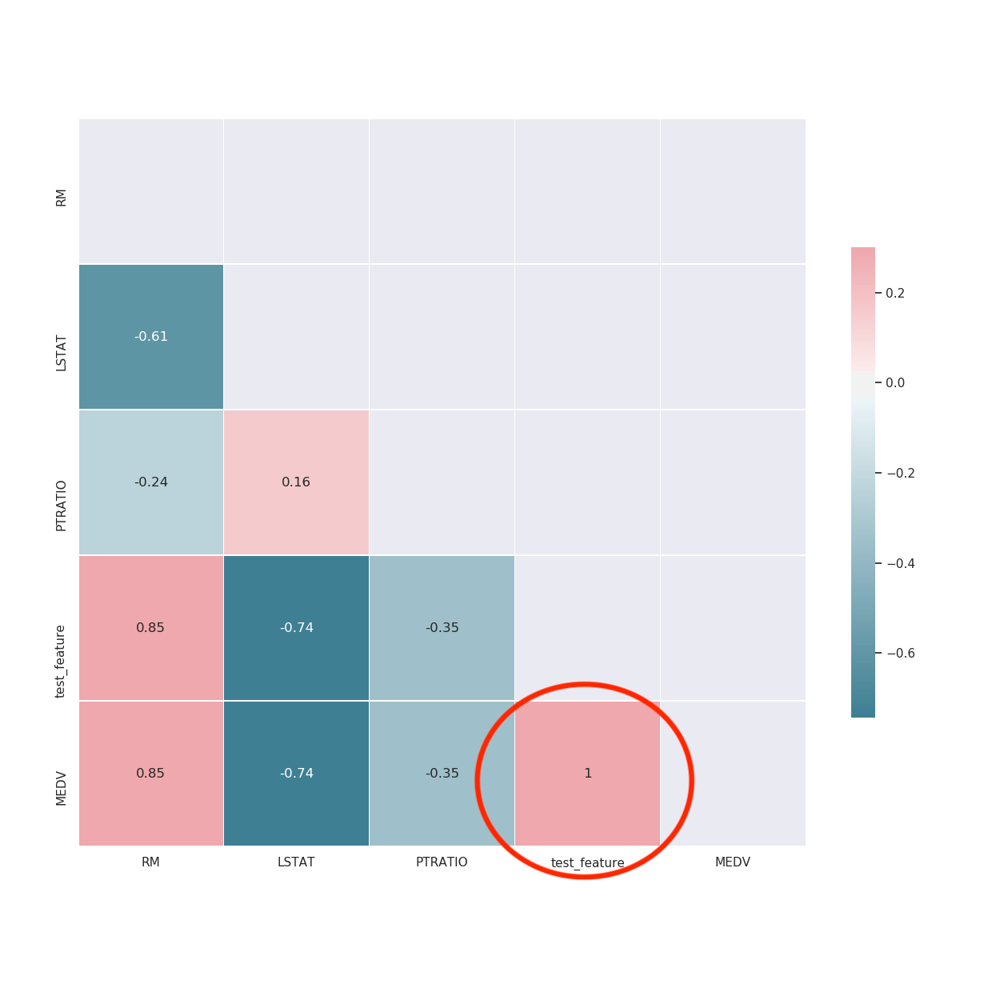

# Intermediate Boston Housing Prices Example

This example creates extends the original [Boston Housing Prices Example](../housing-prices/) to show a multi-pipeline DAG. Each pipeline executes a Python script,  versions the artifacts (datasets, models, etc.), and gives you a full lineage of the model. Once it is set up, you can change, add, or remove data and Pachyderm will automatically keep everything up to date, creating data splits, computing data analysis metrics, and training the model. 

<p align="center">
  
</p>

The Pachyderm pipelines performs the following actions:

1. Version the dataset (`.csv`)
2. Performs data analysis with `scikit-learn`.
3. Split the data into training and testing sets.
4. Trains a regression model to predict housing prices.
5. Generates a learning curve and performance metrics to estimate the quality of the model.

Table of Contents:
- [Housing Prices Dataset](#housing-prices-dataset)
- [Prerequisites](#prerequisites)
- [Pachyderm Pipelines](#pachyderm-pipelines)
  - [Data Analysis Pipeline](#data-analysis-pipeline)
  - [Split Pipeline](#split-pipeline)
  - [Regression Pipeline](#regression-pipeline)
  - [TLDR; Just give me the code](#tldr-just-give-me-the-code)
- [Detailed Walkthrough](#detailed-walkthrough)
  - [Step 1: Create an input data repository](#step-1-create-an-input-data-repository)
  - [Step 2: Create the regression pipeline](#step-2-create-the-regression-pipeline)
  - [Step 3: Add the housing dataset to the repo](#step-3-add-the-housing-dataset-to-the-repo)
  - [Step 4: Download files once the pipeline has finished](#step-4-download-files-once-the-pipeline-has-finished)
  - [Step 5: Update Dataset](#step-5-update-dataset)
  - [Step 6: Inspect the data](#step-6-inspect-the-data)
  - [Step 7: Roll back to the previous commit](#step-7-roll-back-to-the-previous-commit)
  - [Step 8: Update our dataset](#step-8-update-our-dataset)

## Housing Prices Dataset

The housing prices dataset used for this example is a reduced version of the original [Boston Housing Datset](https://www.cs.toronto.edu/~delve/data/boston/bostonDetail.html), which was originally collected by the U.S. Census Service. We choose to focus on three features of the originally dataset (RM, LSTST, and PTRATIO) and the output, or target (MEDV) that we are learning to predict.
|Feature| Description|
|---|---|
|RM |       Average number of rooms per dwelling|
|LSTAT |    A measurement of the socioeconomic status of people living in the area|
|PTRATIO |  Pupil-teacher ratio by town - approximation of the local education system's quality|
|MEDV |     Median value of owner-occupied homes in $1000's|

Sample:
|RM   |LSTAT|PTRATIO|MEDV|
|-----|----|----|--------|
|6.575|4.98|15.3|504000.0|
|6.421|9.14|17.8|453600.0|
|7.185|4.03|17.8|728700.0|
|6.998|2.94|18.7|701400.0|

## Prerequisites

Before you can deploy this example you need to have the following components:

1. A clone of this Pachyderm repository on your local computer. (could potentially include those instructions)
2. A Pachyderm cluster - You can deploy a cluster on [Pachyderm Hub](https://hub.pachyderm.com/) or deploy locally as described [here](https://docs.pachyderm.com/latest/getting_started/).

Verify that your environment is accessible by running `pachctl version` which will show both the `pachctl` and `pachd` versions.
```bash
$ pachctl version
COMPONENT           VERSION
pachctl             1.11.0
pachd               1.11.0
```

## Pachyderm Pipelines

We'll deploy each stage in our ML process as a Pachyderm pipeline. Organizing our work into pipelines allows us to keep track of artifacts created in our ML development process. We can extend or add pipelines at any point to add new functionality or features, while keeping track of code and data changes simultaneously.

### Data Analysis Pipeline
The data analysis pipeline creates a pair plot and a correlation matrix showing the relationship between features. By seeing what features are positively or negatively correlated to the target value (or each other), it can helps us understand what features may be valuable to the model.
<p align="center">
  
  
</p>

### Split Pipeline
Split the input `csv` files into train and test sets. As we new data is added, we will always have access to previous versions of the splits to reproduce experiments and test results. 

Both the `split` pipeline and the `data_analysis` pipeline take the `csv_data` as input but have no dependencies on each other. Pachyderm is able to recognize this. It can run each pipeline simultaneously, scaling each horizontally.

### Regression Pipeline
To train the regression model using scikit-learn. In our case, we will train a Random Forest Regressor ensemble. After splitting the data into features and targets (`X` and `y`), we can fit the model to our parameters. Once the model is trained, we will compute our score (r^2) on the test set. 

After the model is trained we output some visualizations to evaluate its effectiveness of it using the learning curve and other statistics.
<p align="center">
  
</p>


### TLDR; Just give me the code

```bash
# Step 1: Create input data repository
pachctl create repo csv_data

# Step 2: Create the pipelines
pachctl create pipeline -f data_analysis.json
pachctl create pipeline -f split.json
pachctl create pipeline -f regression.json

# Step 3: Add the housing dataset to the repo to kick off all the pipelines
pachctl put file csv_data@master:housing-simplified.csv -f data/housing-simplified-1.csv

# Step 4: Download files once the pipeline has finished
pachctl get file regression@master:/ --recursive --output .

# Step 5: Update dataset with more data (this one has errors in it)
pachctl put file csv_data@master:housing-simplified.csv -f data/housing-simplified-error.csv

# Step 6: Inspect the data
pachctl diff file csv_data@master csv_data@master^

# Step 7: Roll back to the previous dataset commit
pachctl create branch csv_data@master --head master^

# Step 8: Add a new csv file (without the error)
pachctl put file csv_data@master:housing-simplified.csv -f data/housing-simplified-2.csv

```
## Detailed Walkthrough

### Step 1: Create an input data repository

Once the Pachyderm cluster is running, create a data repository called `csv_data` where we will put our dataset.

```bash
$ pachctl create repo housing_data
$ pachctl list repo
NAME                CREATED             SIZE
housing_data        3 seconds ago       0 B
```

### Step 2: Create the regression pipeline

We can now connect a pipeline to watch the data repo. Pipelines are defined in `json` format. Here is the one that we'll be used for the regression pipeline:

```json
# data_analysis.json
{
    "pipeline": {
        "name": "data_analysis"
    },
    "description": "Data analysis pipeline that creates pairplots and correlation matrices for csv files.",
    "input": {
        "pfs": {
            "glob": "/*",
            "repo": "csv_data"
        }
    },
    "transform": {
        "cmd": [
            "python", "data_analysis.py",
            "--input", "/pfs/csv_data/",
            "--target-col", "MEDV",
            "--output", "/pfs/out/"
        ],
        "image": "jimmywhitaker/housing-prices-int:dev0.2"
    }
}
```

For the **input** field in the pipeline definition, we define input data repo(s) and a [glob pattern](https://docs.pachyderm.com/latest/concepts/pipeline-concepts/datum/glob-pattern/). A glob pattern tells the pipeline how to map data into a job, here we have it create a new job for each datum in the `housing_data` repository.

The **image** defines what Docker image will be used for the pipeline, and the **transform** is the command run once a pipeline job starts.

Once this pipeline is created, it watches for any changes to its input, and if detected, it starts a new job to train given the new dataset.

```bash
$ pachctl create pipeline -f regression.json
```

The pipeline writes the output to a PFS repo (`/pfs/out/` in the pipeline json) created with the same name as the pipeline.

### Step 3: Add the housing dataset to the repo
Now we can add the data, which will kick off the processing automatically. If we update the data with a new commit, then the pipeline will automatically re-run. 

```bash
$ pachctl put file housing_data@master:housing-simplified.csv -f data/housing-simplified-1.csv
```

We can inspect that the data is in the repository by looking at the files in the repository.

```bash
$ pachctl list file housing_data@master
NAME                    TYPE SIZE
/housing-simplified.csv file 12.14KiB
```

We can see that the pipeline is running by looking at the status of the job(s). 

```bash
$ pachctl list job
ID                               PIPELINE   STARTED        DURATION   RESTART PROGRESS  DL       UL      STATE
299b4f36535e47e399e7df7fc6ee2f7f regression 23 seconds ago 18 seconds 0       1 + 0 / 1 2.482KiB 1002KiB success
```

### Step 4: Download files once the pipeline has finished
Once the pipeline is completed, we can download the files that were created.

```bash
$ pachctl list file regression@master
NAME               TYPE SIZE
/housing-simplified_corr_matrix.png   file 18.66KiB
/housing-simplified_cv_reg_output.png file 62.19KiB
/housing-simplified_final_model.sav   file 1.007KiB
/housing-simplified_pairplot.png      file 207.5KiB

$ pachctl get file regression@master:/ --recursive --output .
```

When we inspect the learning curve, we can see that there is a large gap between the training score and the validation score. This typically indicates that our model could benefit from the addition of more data. 

<p align="center">
  
</p>

Now let's update our dataset with additional examples.

### Step 5: Update Dataset
Similar to the original housing prices example, we'll now add some new data. 

```bash
$ pachctl put file csv_data@master:housing-simplified.csv -f data/housing-simplified-error.csv
```

The new commit of data to the `csv_data` repository automatically kicks off a jobs on the downstream pipelines. 

Only this time, the new data has an error in it. We've added a new feature to our dataset, a `test_feature` that is an accidental duplication of our target column. Obviously, any model built with oracle information will not work in the real world. 

When we look at our data analysis output, we can see that the correlation matrix shows our new feature has a correlation of `1` with our target. The pair plot shows the linear relationship of our features.

<p align="center">
  
</p>

### Step 6: Inspect the data

We can inspect the difference in our data by using the `diff file` command.

```bash
$ pachctl diff file csv_data@master csv_data@master^
diff --git a/var/folders/jj/j322r7t156l0cysg8jqswvhw0000gn/T/housing-simplified.csv_368103379 b/var/folders/jj/j322r7t156l0cysg8jqswvhw0000gn/T/housing-simplified.csv_586389828
index 9a01e63..58f4021 100644
--- a/var/folders/jj/j322r7t156l0cysg8jqswvhw0000gn/T/housing-simplified.csv_368103379
+++ b/var/folders/jj/j322r7t156l0cysg8jqswvhw0000gn/T/housing-simplified.csv_586389828
@@ -1,101 +1,101 @@
-RM,LSTAT,PTRATIO,MEDV
-6.575,4.98,15.3,504000.0
...
+RM,LSTAT,PTRATIO,test_feature,MEDV
+6.575,4.98,15.3,504000.0,504000.0
```

We can see the new feature column in the diff that is causing our issue.

### Step 7: Roll back to the previous commit
Let's undo this change by rolling back to the previous version of the dataset. We can do this by using the `create branch` command and passing it the current parent of the master commit by using the `^` character. For more info on referencing parent commits, see [Ancestry Syntax](https://docs.pachyderm.com/latest/concepts/data-concepts/history/#ancestry-syntax).

```bash
$ pachctl create branch csv_data@master --head master^
```

If we inspect the data_analysis output now, we can see that we're using the previous version of the dataset. 

### Step 8: Update our dataset
Now we can update our dataset with additional data not containing the error, and our pipelines will automatically update again.

```bash
pachctl put file csv_data@master:housing-simplified.csv -f data/housing-simplified-2.csv
```
