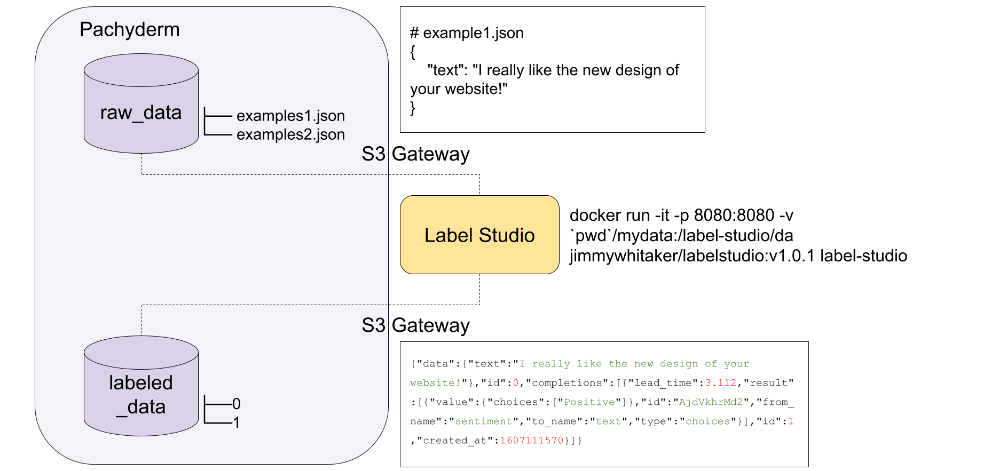
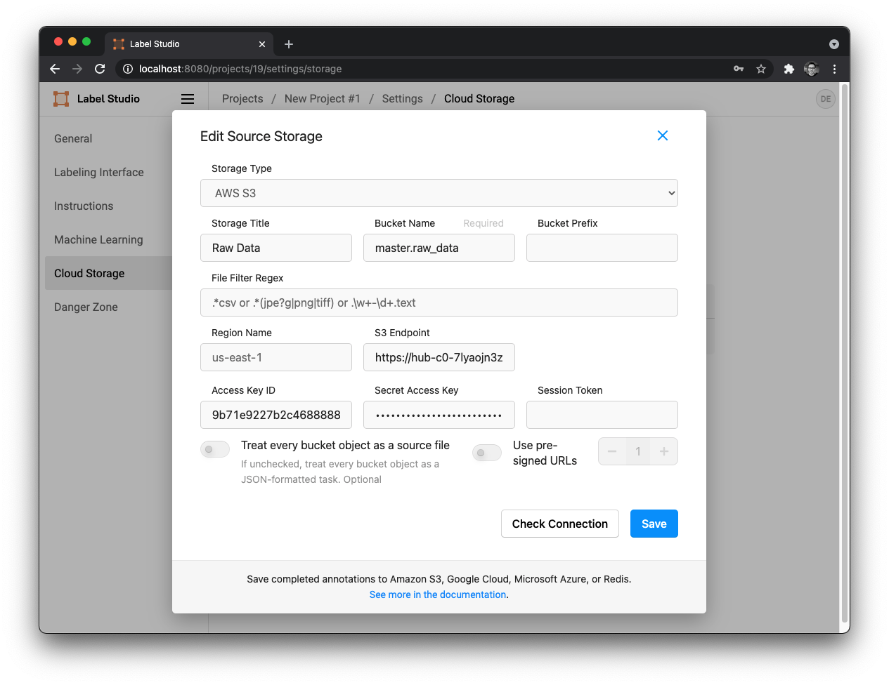

# Label Studio with Pachyderm

<p align="center">
	
</p>

[Label Studio](https://labelstud.io/) supports many different types of data labeling tasks, while [Pachyderm](https://www.pachyderm.com/) allows you to incorporate data versioning and data-driven pipelines, enabling the management of the [data loop](https://jimmymwhitaker.medium.com/completing-the-machine-learning-loop-e03c784eaab4). This integration connects a Pachyderm versioned data backend with Label Studio to support versioning datasets and tracking the data lineage of pipelines built off the versioned datasets.

## How it works

Label Studio can utilize an S3 backend, reading data from an S3 bucket and writing labels to an output S3 location. Pachyderm has an S3 compliant gateway that allows reading data from its file system and writing data to its filesystem (organizing it with commits that can start pipelines).

We'll create a text labeling example by:

1. Start a Label Studio instance 
2. Configure Pachyderm as Label Studio's S3 data backend
3. Push data to Pachyderm 
4. Import the data in Label Studio
5. Label our data in Label Studio
6. Data is automatically versioned in Pachyderm

## Getting Started
This example uses a Pachyderm deployment for scaling and management. We can deploy a cluster on [Pacyderm Hub](hub.pachyderm.com) for free or deploy locally as described here: [Pachyderm Getting Started](https://docs.pachyderm.com/latest/getting_started/)

Once the Pachyderm cluster is up, we can check the setup by running: 
1. `kubectl get all` to ensure all the pods are up and ready. 
2. `pachctl version` which will show both the `pachctl` and `pachd` versions.

## Running Label Studio
In this example, we will run label studio locally, using Docker. 

```bash
docker run -it -p 8080:8080 -v `pwd`/mydata:/label-studio/data jimmywhitaker/labelstudio:v1.0.1 label-studio
```

Once running, we can access label studio by visiting: [http://localhost:8080/](http://localhost:8080/).

Once we create a user, new project, and select our labeling task, we can configure the Cloud Storage settings to point to Pachyderm, using the AWS S3 Storage Type.

### Configuring Source and Target Storage
Selecting Cloud Storage from the Label Studio settings will allow us to add Source and Target Storage sync our data with. 

You will need to configure two parameters in order to pull data from Pachyderm into the Label Studio environment. 

First, pachyderm data repositories for source and target storage should be created. We can do that by running: 

```bash
pachctl create repo raw_data
pachctl create repo labeled_data
pachctl create branch labeled_data@master
pachctl create branch raw_data@master
```

Next, we can add Pachyderm as our source and target storages by configuring them in the Label Studio Settings as shown below: 

<p align="center">
	
</p>

The bucket name is determined by the data repository and branch we are referencing. Here, for example, `raw_data@master` can be referenced with the S3 Gateway as the bucket `master.raw_data`. 

We will not use pre-signed URLs for Pachyderm storage. For the NLP example, we will also unselect `treat every bucket as a source file` (image tasks should enable this feature).

We can check the connection to make sure it is correct by pressing the "Check Connection" button and then once it is saved, we can sync our data from the source storage.

Note: This is a one time operation, so we must press this button whenever we want to sync new examples. 

### Endpoint URL
If you are running your cluster on Pachyderm Hub, you can find out your `ENDPOINT_URL` by clicking the `Connect` button. You should see an address that looks something like: 

`grpcs://hub-xx-xxxYYxxYY.clusters.pachyderm.io:31400`

Just change the protocol to `https` and port to `30600`. This will now point at the S3 gateway. 

`https://hub-xx-xxxYYxxYY.clusters.pachyderm.io:30600`

### Session Token
The `AWS_ACCESS_KEY_ID` and `AWS_SECRET_ACCESS_KEY` in your configuration should **both** be set to your Pachyderm `session_token` located in your Pachyderm config (typically in `~/.pachyderm/config.json`). More info on Pachyderm's [S3 gateway](https://docs.pachyderm.com/latest/deploy-manage/manage/s3gateway/configure-s3client/). 

#### Minikube configuration
If you are running Pachyderm locally on minikube, you can get the `ENDPOINT_URL` for the Pachyderm S3 gateway by running the command:

```
$ minikube ip
192.168.64.8
```

If you are running Pachyderm with authentication, then you can follow the same steps as the Hub setup to set the `AWS_ACCESS_KEY_ID` and `AWS_SECRET_ACCESS_KEY`. If not running with authentication, you can pass any non-empty string to `AWS_ACCESS_KEY_ID` and `AWS_SECRET_ACCESS_KEY` in your S3 Source/Target Configuration.

## Running the Text Labeling Example

``` bash
# Pachyderm Setup
pachctl create repo raw_data
pachctl create repo labeled_data
pachctl create branch labeled_data@master
pachctl create branch raw_data@master

# Start a local instance of Label Studio (needs the .env for the Pach S3 gateway)
docker run -it -p 8080:8080 -v `pwd`/mydata:/label-studio/data jimmywhitaker/labelstudio:v1.0.1

# Navigate to http://localhost:8080/

# Upload data
pachctl put file raw_data@master:/test-example.json -f raw_data/test-example.json --split json --target-file-datums 1

# Sync the Source Cloud Storage to import the examples

# Label data (2 examples) in the UI

# Version your dataset (v1)
pachctl list branch labeled_data
pachctl create branch labeled_data@v1 --head master
pachctl list branch labeled_data

# Label more data in the UI

# Version your dataset (v2)
pachctl list branch labeled_data
pachctl create branch labeled_data@v2 --head master

# Download dataset for v1 locally
pachctl get file -r labeled_data@v1:/ -o labeled_data/

```

### Additional Notes 
___
This project was originally [here](https://github.com/JimmyWhitaker/label-studio-pach/) before being migrated. 
____

If you get the following error, 

```
botocore.exceptions.ClientError: An error occurred (403) when calling the HeadBucket operation: Forbidden
```

this is typically due to an expired session token. Reconnect to the cluster and update your source/target configuration with the new token. 

___

When a source file is updated after labeled, it is not re-loaded.

* When raw data is changed after it is imported, the task doesn't update.

* Open question on desirable behavior: If a raw file is removed or changed, then labels associated with that file should be removed. Since it's a single file per example, a changed file should be the deleting of one and addition of another.
