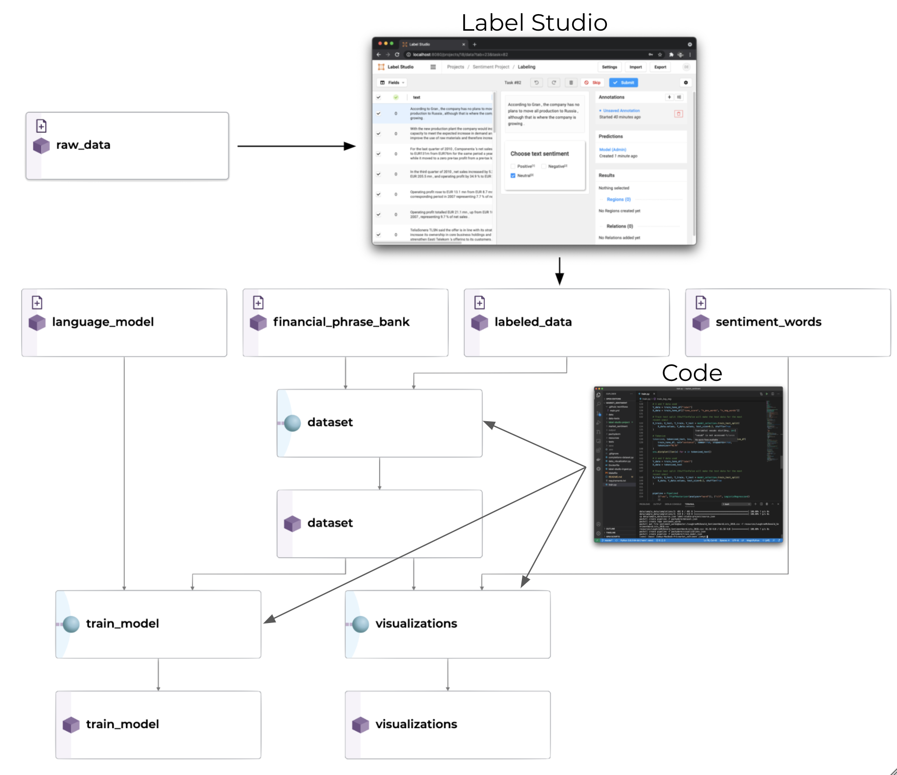

# Market Sentiment

<p align="center">
	
</p>


In this example, we show a market sentiment NLP implementation in Pachyderm. In it, we use [transfer learning](https://en.wikipedia.org/wiki/Transfer_learning) to fine-tune a BERT language model to classify text for financial sentiment. It shows how to combine inputs from separate sources, incorporates data labeling, model training, and data visualization.


This example requires general knowledge of Pachyderm, which can be obtained through the Boston Housing Prices examples: [Intro](https://github.com/pachyderm/examples/blob/master/housing-prices) and [Intermediate](https://github.com/pachyderm/examples/blob/master/housing-prices-intermediate). 


## TLDR;
```bash
# Upload the Financial Phrase Bank data
pachctl create repo financial_phrase_bank
cd data/FinancialPhraseBank/; pachctl put file financial_phrase_bank@master -f Sentences_AllAgree.txt

# Upload the pre-trained BERT language model
pachctl create repo language_model
cd models/finbertTRC2/; pachctl put file -r language_model@master -f ./

# Set up Label Studio for production data
pachctl create repo labeled_data
pachctl create repo raw_data
pachctl create branch labeled_data@master
pachctl create branch raw_data@master
docker run -it -p 8080:8080 -v `pwd`/mydata:/label-studio/data jimmywhitaker/labelstudio:v1.0.1

# Deploy the dataset creation pipeline
pachctl create pipeline -f pachyderm/dataset.json

# Use a sentiment word list to visualize the current dataset
pachctl create repo sentiment_words
pachctl put file sentiment_words@master:/LoughranMcDonald_SentimentWordLists_2018.csv -f resources/LoughranMcDonald_SentimentWordLists_2018.csv
pachctl create pipeline -f pachyderm/visualizations.json

# Deploy the training pipeline
pachctl create pipeline -f pachyderm/train_model.json

# Version our current dataset
pachctl create branch dataset@v1 --head master

# Modify the version of Financial Phrase Bank dataset used
pachctl start commit financial_phrase_bank@master
pachctl delete file financial_phrase_bank@master:/Sentences_AllAgree.txt
pachctl put file financial_phrase_bank@master:/Sentences_50Agree.txt -f data/FinancialPhraseBank/Sentences_50Agree.txt
pachctl finish commit financial_phrase_bank@master

# Version our new dataset
pachctl create branch dataset@v2 --head master

```

## The Data
We will use the [Financial Phrase Bank Dataset](https://www.researchgate.net/profile/Pekka_Malo/publication/251231364_FinancialPhraseBank-v10) as a starting point for our model. This data will be combined with new, human labeled data from our production environment.  In this example, dataset for simplicity and transparency to show the interactions more than the techniques themselves.

There are different versions of the Financial Phrase Bank Dataset, according to how many human labelers agreed with one another on the sentiment class of the text statement. For example, the `AllAgree` dataset is when all human labelers were in agreement with the sentiment of the sentence, while `50Agree` represents the dataset where more than 50% were in agreement with each other (more data, but potentially less accurate).

## The Model
FinBERT is a pre-trained NLP model that is adapted to analyze the sentiment of financial text. The original BERT-based language model was trained with a large corpus of Reuters and training code used in this example, [FinBERT](https://huggingface.co/ProsusAI/finbert). The base model is built on a large subset of  Reuters TRC2 dataset. We will be tuning this pre-trained language model (transfer learning) for sentiment analysis using the Financial Phrase Bank Dataset.

## Pre-requisites
Before you can deploy this example you need to have the following components:

1. A clone of this repository on your local computer. 
2. The Financial Phrase Bank Dataset should be downloaded and placed in `data/FinancialPhraseBank/`. 
3. A Pachyderm cluster - You can deploy a cluster on [Pachyderm Hub](https://hub.pachyderm.com/) or deploy locally as described [here](https://docs.pachyderm.com/latest/getting_started/).
4. [Docker](https://docs.docker.com/get-docker/) installed (for Label Studio integration)

Verify that your environment is accessible by running `pachctl version` which will show both the `pachctl` and `pachd` versions.
```bash
$ pachctl version
COMPONENT           VERSION
pachctl             1.13.0
pachd               1.13.0
```

## Labeling
Most production machine learning models rely on supervised learning, however incorporating new, labeled data into a model is often a manual process. Pachyderm helps us avoid that by versioning our data and automatically running pipelines when our data changes.

In this example, we integrate [Label Studio](https://labelstud.io/) to facilitate human interaction while providing training and deployment automation.

For more details on creating a sentiment analysis labeling project, see our [example integration](https://github.com/pachyderm/examples/tree/master/label-studio). 

## Dataset Creation

The dataset creation step will combine the Financial Phrase Bank dataset with newly labeled data into a single dataset. It is a simple script that takes the Union of the `financial_phrase_bank` and `labeled_data` repositories to generate a single dataset. 

## Model Training
Our model training pipeline uses the BERT fine-tuning script from [FinBERT](https://huggingface.co/ProsusAI/finbert). It relies on two input repositories. 
1. The language model - our pre-trained financial language model that will be tuned to our new task. 
2. The dataset - sentiment analysis data that will be used to train our model.

## Visualization
The `visualization` pipeline provides exploration and understanding of our dataset and includes the following.  
1. Correlation matrix showing the relationship between the sentiment words and the assigned label. 
2. Histogram of frequent words in the training set. 
3. Word cloud of the training data. 

<!-- ## Deployment
WIP

## Iteration -->
