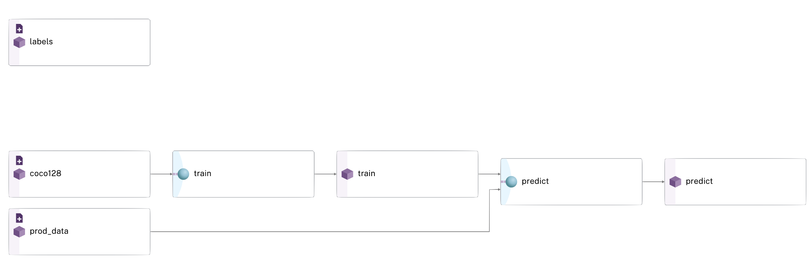

# Object Detection

This example illustrates a common Object Detection use case using [Pachyderm](https://www.pachyderm.com/), [Lightning Flash](https://lightning-flash.readthedocs.io/en/latest/), and [Label Studio](https://labelstud.io/). 

<p align="center">
	
</p>

This demo mimics the object detection [example from Lightning Flash](https://lightning-flash.readthedocs.io/en/stable/reference/object_detection.html#example). We extend the example to predict on new data that can be used to produce predictions for the [Pachyderm Label Studio integration](https://github.com/pachyderm/label-studio) to refine and improve your training data.

## Dataset
The dataset used for this example is the COCO 128 dataset, which is a subset of [COCOtrain2017](https://cocodataset.org/), containing 80 object classes. 

## Notebook
For the detailed walkthrough, view our [notebook version of this example](Object%20Detection%20Example.ipynb). 

## TLDR; 
Just give me the code!

```bash
wget https://github.com/zhiqwang/yolov5-rt-stack/releases/download/v0.3.0/coco128.zip
unzip coco128.zip

# Push training dataset to Pachyderm
pachctl create repo coco128
pachctl put file -r coco128@master:/ -f coco128

# Deploy model training pipeline
pachctl create pipeline -f pachyderm/model.json

# Create repo to hold production data
pachctl create repo inference_images
pachctl put file -r inference_images@master:/dog1.jpeg -f images/dog1.jpeg

# Deploy prediction pipeline
pachctl create pipeline -f pachyderm/predictions.json

# Deploy bounding box visualization pipeline 
pachctl create pipeline -f pachyderm/bboxes.json

# Create labels repo for modified annotations
pachctl create repo labels

# Start and configure Label Studio
docker run -it --rm -p8080:8080 -v ~/.pachyderm/config.json:/root/.pachyderm/config.json --device=/dev/fuse --cap-add SYS_ADMIN --name label-studio --entrypoint=/usr/local/bin/label-studio jimmywhitaker/label-studio:pach2.2-ls1.4v3

# Source repos: inference_images, predictions
# Target repo: labels

# Add more data (automatically runs pipelines)
pachctl put file -r inference_images@master:/car6.jpeg -f images/car6.jpeg
```
