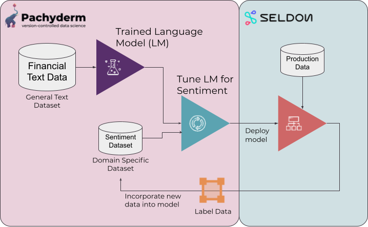

# Seldon Deployment - Market Sentiment

<p align="center">
	
</p>

In this example, we show you how to deploy the model created in the [Market Sentiment Example](../market-sentiment) in Seldon Deploy.

Once deployed, we can configure and run the [`query_es`](pachyderm/query_es.json) pipeline, to automatically download inference data into our data labeling environment. 

## Requirements
1. A Pachyderm cluster with the running [Market Sentiment Example](../market-sentiment).
2. A [Seldon Deploy](https://www.seldon.io/tech/products/deploy/) cluster.

## Running the Pre-build Example

If you want to run the current built version of this example, you can run the server locally with:
```
docker run --name "market-sentiment-classifier" -d --rm -p 9001:9000 jimmywhitaker/market-sentiment-classifier:0.6
```
or deploy this image with Seldon Deploy.

## Building It Yourself

To build the deployment image from scratch, follow the instructions presented in [Seldon Build Process](./SeldonBuildProcess.md).

Many of the steps used in the creation of this deployment were found in the [Spacy Example](https://docs.seldon.io/projects/seldon-core/en/latest/examples/sklearn_spacy_text_classifier_example.html). For more information, see the [Seldon Documentation](https://docs.seldon.io).

Once the Seldon deployment is up and running, you can ingest predictions back into Pachyderm by configuring and creating the [elastic search ingestion pipeline](pachyderm/query_ex.json).

## Running the Elastic Search ingest
Build the Seldon Docker container and then run the ingestion pipeline.

```bash
# Ingest predictions Seldon Elastic Search (must configure pipeline to point to Seldon cluster)
pachctl create pipeline -f pachyderm/query_es.json
```