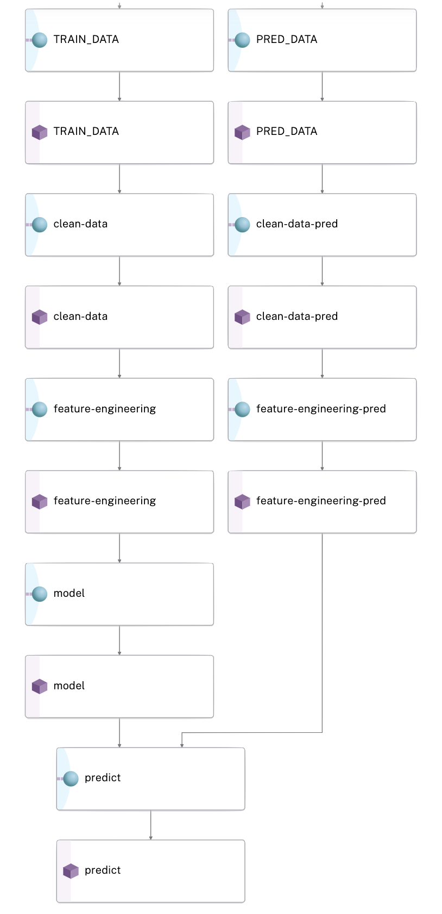

# Churn Prediction with Snowflake

[Predicting churn](https://www.investopedia.com/terms/c/churnrate.asp) is a task to determine whether a user will renew their subscription or not to a particular service. 

In this example, we use the [KKBox Churn Prediction challenge dataset](https://www.kaggle.com/competitions/kkbox-churn-prediction-challenge/data) from [Kaggle](https://www.kaggle.com/) to show a real world setup for predicting churn for a music service. To this end, we use [Snowflake](https://www.snowflake.com/) as our data warehouse where our source data resides and [Pachyderm](https://www.pachyderm.com/) as our data versioning and processing platform for non-SQL transformations. 

  

Specifically, this example shows how to integrate with and use data from a data warehouse to apply coding

In it you'll learn how to:
- Ingest data from Snowflake using the [Data Warehouse Integration](https://docs.pachyderm.com/latest/how-tos/basic-data-operations/sql-ingest/#data-warehouse-integration)
- Transform your data to prepare it for model training
- Train a churn model
- Predict on new data with our churn model
- Egress our predictions back to Snowflake using [Pachyderm's Egress Feature](https://docs.pachyderm.com/latest/how-tos/basic-data-operations/export-data-out-pachyderm/sql-egress/#egress-to-an-sql-database)

## Requirements
Before you can deploy this example you need to have the following components:

1. Snowflake account access (SYSADMIN role)
2. A [Pachyderm Cluster](https://docs.pachyderm.com/latest/deploy-manage/deploy/)
3. [kubectl](https://kubernetes.io/docs/tasks/tools/) installed with Kubernetes access to where your Pachyderm cluster is running 

## Churn
Churn prediction focuses on the goal of identifying customers likely to discontinue their subscription to a service. The ability to do this gives businesses the ability to effectively address users issues to build effective strategies to maintain their business or support. Thus, the real goal of predicting churn is to be proactive and prevent it from happening. 

In this example, we're training a model to predict churn for KKBox. 

Here's a brief description of the problem from [Kaggle](https://www.kaggle.com/competitions/kkbox-churn-prediction-challenge/data). 

> KKBOX offers subscription based music streaming service. When users signs up for our service, users can choose to either manual renew or auto-renew the service. Users can actively cancel their membership at any time.

> The churn/renewal definition can be tricky due to KKBox's subscription model. Since the majority of KKBox's subscription length is 30 days, a lot of users re-subscribe every month. The key fields to determine churn/renewal are transaction date, membership expiration date, and is_cancel. Note that the is_cancel field indicates whether a user actively cancels a subscription. Subscription cancellation does not imply the user has churned. A user may cancel service subscription due to change of service plans or other reasons. The criteria of "churn" is no new valid service subscription within 30 days after the current membership expires.

## KKBox Dataset
There are 4 sources of data for KKBox. 

1. **train** - the train set, containing the user ids and whether they have churned.
2. **transactions** - transactions of users
3. **user_logs** - daily user logs describing listening behaviors
4. **members** - user information including things such as city, birthday, gender, etc. 

These data sources can be combined and used together to create a dataset with which to predict churn.

For full details of the dataset, view the Tables section of the [Kaggle competition page](https://www.kaggle.com/competitions/kkbox-churn-prediction-challenge/data). 

## Running the Example
The [Snowflake Churn Example notebook](./Churn%20Analysis%20with%20Pachyderm%20and%20Snowflake.ipynb) gives a full walkthrough with details of how the churn example works. We recommend walking through the steps provided there, though the commands themselves can also be run in a terminal. 