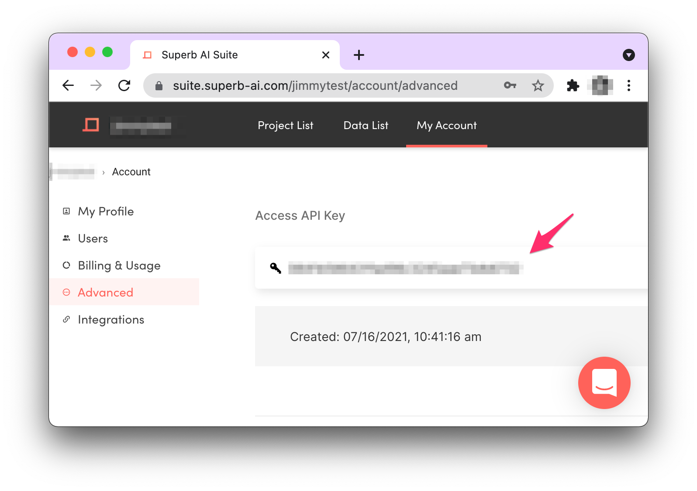
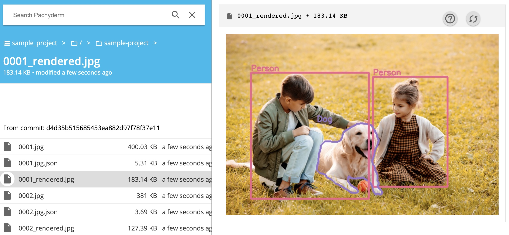

# Superb.ai + Pachyderm Integration


This example shows how you can create a [Pachyderm](https://www.pachyderm.com/) pipeline to automatically version and save data you've labeled in [Superb.ai](https://www.superb-ai.com/) to use in downstream machine learning workflows. 

The integration connects to your SuperbAI project, ingests the data into Pachyderm on a [cron schedule](https://docs.pachyderm.com/latest/concepts/pipeline-concepts/pipeline/cron/). 

Once your data is ingested into Pachyderm, you can perform data tests, train a model, or any other type of data automation you may want to do, all while having full end-to-end reproducibility. 

## Requirements 
You will need an account for each of the tools. Free accounts can now be used to run this example! 
* [Superb.AI account](https://suite.superb-ai.com/auth/create?from=homepage)
* Setup a [Pachyderm Hub](https://docs.pachyderm.com/latest/hub/hub_getting_started/) Cluster


## Run this example


1. Generate an Access API Key in SuperbAI. 

2. Put the key and your user name in the [`secrets.json`](secrets.json) file. 
3. Create the Pachyderm secret

```bash
pachctl create secret -f secrets.json
```

4. Create the cron pipeline to synchronize your `Sample project` from SuperbAI to Pachyderm. This pipeline will run every minute to check for new data (you can configure it to run more or less often in the cron spec in `sample_project.yml`).

```bash
pachctl create pipeline -f sample_project.yml
```

5. Pachyderm will automatically kick off the pipeline and import the data from your sample project. 
