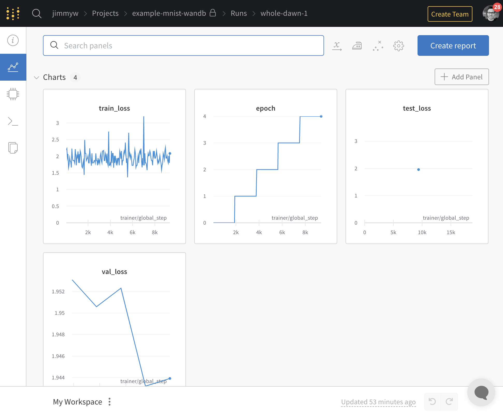
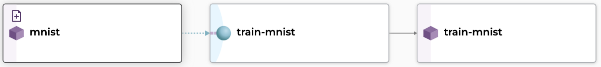

# Pachyderm + Weights and Biases
Pachyderm logging to Weights and Biases. Using Pachyderm as our execution platform, we can version our executions, code, data, and models while still tracking everything in W&B. 

  

Here we'll use Pachyderm to manage our data and train our model. 

  

## Running the Example

1. Create a [Pachyderm cluster](https://docs.pachyderm.com/latest/getting_started/).
2. Create a [W&B Account](https://wandb.ai/) 
3. Copy your [W&B API Key](https://wandb.ai/authorize) into the `secrets.json` file. We'll use this file to make a [Pachyderm secret](https://docs.pachyderm.com/2.3.x/how-tos/advanced-data-operations/secrets/#create-your-secret-in-pachyderm). This keeps our access keys from being built into our container or put in plaintext somewhere.
4. Create the secret with `pachctl create secret -f secrets.json`
5. Run `make all` to create a data repository and the pipeline. 

Note: Downloading the data locally and then pushing it to Pachyderm may seem counterintuitive at first. Downloading the data locally and then pushing it to a remote cluster seems like an extra step, especially when dealing with a standard dataset like MNIST. However, if we think about a real world use case where multiple teams may be manipulating the data (removing examples, adding classes, etc.) then having a history for each of these models can be very useful. In most production settings with supervised learning, the [labeling environment can be directly connected to the data repository](https://towardsdatascience.com/versioning-and-labeling-better-together-2dd7d4fe8bd9), automating this step.

## MNIST example

- Creates a project in W&B with the name of the Pachyderm pipeline. 
- Trains an MNIST classifier in a Pachyderm Job.
- Logs training info from training to W&B.
- If the Data or Pachyderm Pipeline changes, it kicks off a new training process.
